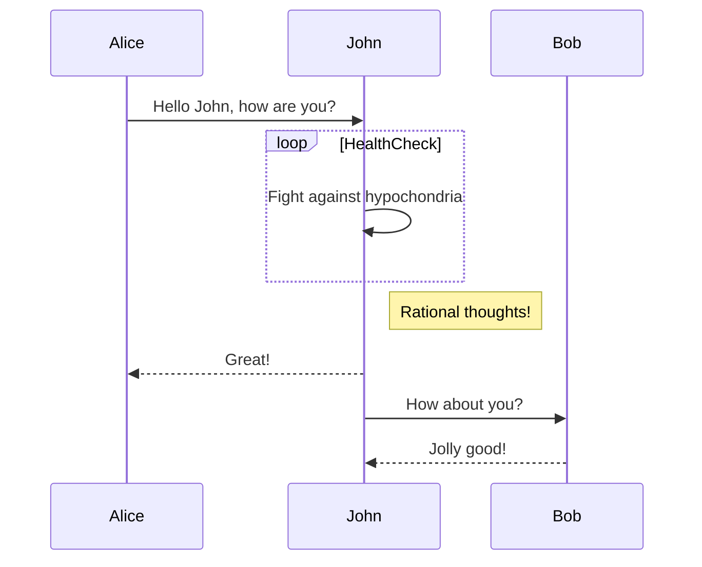
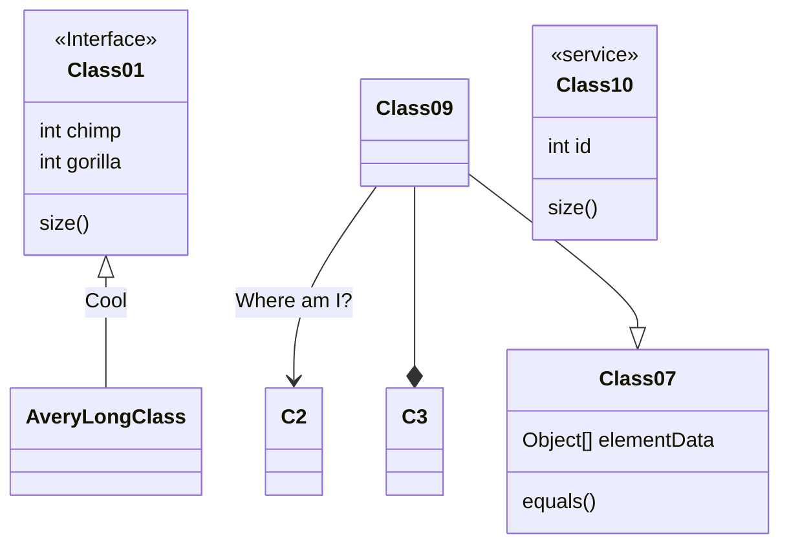
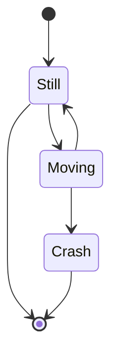
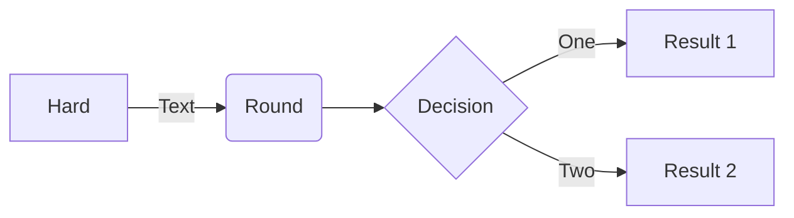

# my_mermaid
Uma imagem vale mais que mil palavras. Agora você pode criar e editar rapidamente diagramas em markdown usando palavras com suporte Mermaid em seus arquivos Markdown.

Mermaid é uma ferramenta de diagramação e gráficos baseada em JavaScript que usa definições de texto inspiradas em Markdown e cria diagramas dinamicamente no navegador. Mantido por Knut Sveidqvist , ele oferece suporte a vários tipos de diagramas comuns para projetos de software, incluindo fluxogramas, UML, gráficos Git, diagramas de jornada do usuário e até mesmo o temido gráfico de Gantt.

##Como funciona
Quando encontramos blocos de código marcados como mermaid, geramos um iframe que pega a sintaxe bruta do Mermaid e a passa para Mermaid.js, transformando esse código em um diagrama em seu navegador local.

## DIAGRAMA DE SEQUÊNCIA

### SINTAXE MERMAID DO DIAGRAMA DE SEQUÊNCIA
       ```mermaid
       sequenceDiagram
       Alice->>John: Hello John, how are you?
       loop HealthCheck
           John->>John: Fight against hypochondria
       end
       Note right of John: Rational thoughts!
       John-->>Alice: Great!
       John->>Bob: How about you?
       Bob-->>John: Jolly good!
       ```

## DIAGRAMA DE CLASSES

### SINTAXE MERMAID DO DIAGRAMA DE CLASSES
       ```mermaid
       classDiagram
       Class01 <|-- AveryLongClass : Cool
       <<Interface>> Class01
       Class09 --> C2 : Where am I?
       Class09 --* C3
       Class09 --|> Class07
       Class07 : equals()
       Class07 : Object[] elementData
       Class01 : size()
       Class01 : int chimp
       Class01 : int gorilla
       class Class10 {
         <<service>>
         int id
         size()
       }
       ```

## DIAGRAMA DE ESTADO

## FLUXOGRAMA

